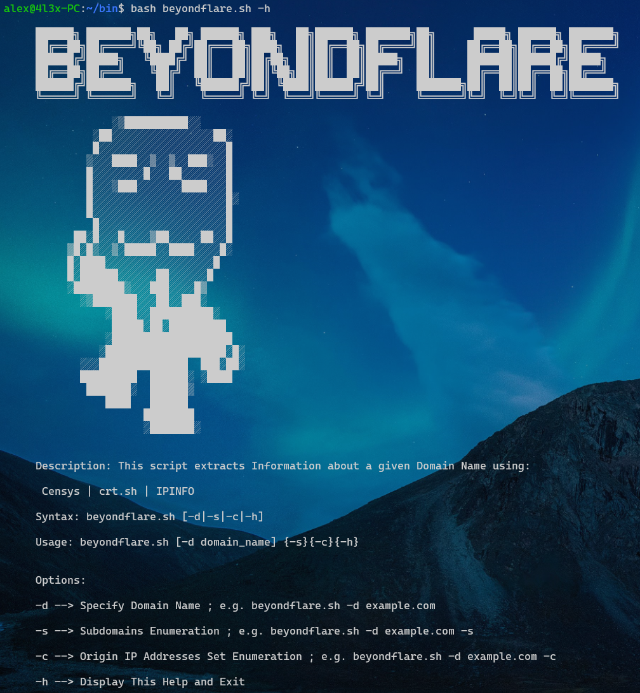

  <h1></h1>

   
  
   
  
  
  
  
 
  
  
   

   &nbsp;&nbsp;
   &nbsp;&nbsp; 

   </a>

  
<b>Useful Tool to try Bypass CloudFlare Proxies ☁️ and Get Origin IP Server 🖥️<b>
 
  
  
  
   
  
   &nbsp;&nbsp;&nbsp; 
  
  
  
    

